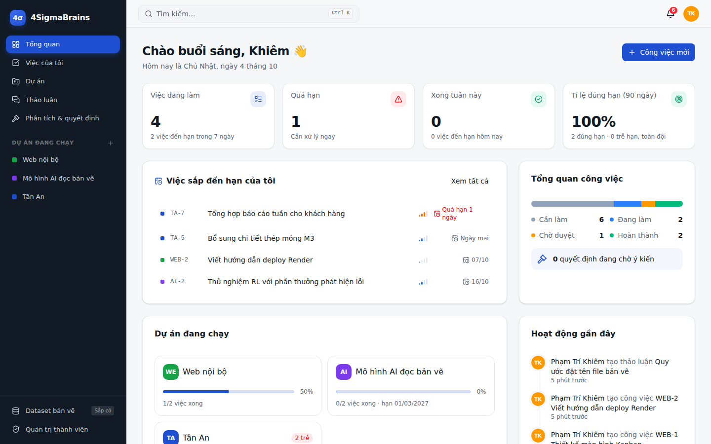

# 4SigmaBrains Workspace

Web nội bộ của 4SigmaBrains: giao việc, theo dõi hạn, thảo luận và ra quyết định trong một nơi. Sau này thêm module Dataset bản vẽ và agent AI.



## Có gì trong bản này

| Nhóm | Chức năng |
| --- | --- |
| Tài khoản | Đăng nhập Google, người mới chờ duyệt, phân quyền Quản trị / Quản lý / Thành viên, hồ sơ cá nhân |
| Tổng quan | Việc đang làm, quá hạn, tỉ lệ đúng hạn, việc sắp đến hạn, tiến độ dự án, hoạt động gần đây |
| Dự án | Thành viên + trưởng dự án, Kanban kéo thả, danh sách, lịch, tài liệu, thảo luận, lịch sử hoạt động |
| Công việc | Mã việc (TA-12), người làm, ưu tiên, hạn chót, nhãn, checklist, file đính kèm, bình luận @nhắc tên, đánh dấu đúng hạn / trễ hạn |
| Nhắc hạn | Tự nhắc trước hạn 24 giờ và khi quá hạn, qua thông báo trong app (realtime) và email |
| Thảo luận | Chủ đề chung hoặc theo dự án, trả lời, @nhắc tên, đính kèm file |
| Phân tích & quyết định | Bối cảnh, các phương án (ưu / nhược), bình chọn, chốt phương án kèm lý do |
| Khác | Tìm kiếm nhanh `Ctrl K`, chế độ tối, giao diện điện thoại, trang quản trị thành viên, trang Dataset (sắp có) |

## Cấu trúc thư mục

```
apps/
  frontend/                 FE: React 19 + TypeScript (Vite), Tailwind v4, shadcn/ui, TanStack Query
    src/pages/              Mỗi trang một file (dashboard, my-tasks, project-detail, ...)
    src/features/           Logic theo nghiệp vụ: auth, projects, tasks, discussions, decisions, notifications
    src/components/         Component dùng chung; ui/ là shadcn, layout/ là sidebar, thanh trên, Ctrl K
    src/lib/                Gọi API, định dạng ngày, hằng số, theme
  backend/                  BE: NestJS 12, TypeORM, PostgreSQL
    src/modules/            auth, users, projects, tasks, attachments, discussions, decisions,
                            notifications (Socket.IO + email), activity, dashboard, search, health
    src/infrastructure/     Lưu file chuẩn S3 (MinIO / Cloudflare R2)
    src/database/           Cấu hình, entity, migrations (tự chạy khi khởi động)
    src/config/             Đọc và kiểm tra biến môi trường
infra/                      DevOps / server
  docker/                   docker-compose.dev.yml (Postgres + MinIO để code), docker-compose.yml (chạy cả hệ thống)
  server/                   Caddyfile (HTTPS tự động), nginx.conf (nếu máy chủ có sẵn Nginx)
  scripts/                  Sao lưu / khôi phục database, tạo khoá bí mật
.github/workflows/          ci.yml (lint, test, build), reminders.yml (nhắc hạn mỗi giờ), backup.yml (sao lưu hằng tuần)
Dockerfile                  Một image: backend phục vụ luôn giao diện
render.yaml                 Cấu hình deploy miễn phí lên Render
docs/                       Kiến trúc, hướng dẫn deploy, ảnh chụp
```

Chi tiết: [docs/kien-truc.md](docs/kien-truc.md). Deploy miễn phí: [docs/deploy-mien-phi.md](docs/deploy-mien-phi.md).

## Chạy trên máy để phát triển

Cần Node 22+, **npm 11+** (`npm i -g npm@11`, npm 10 lỗi khi cài backend) và Docker.

```bash
cp .env.example .env      # điền GOOGLE_CLIENT_ID, GOOGLE_CLIENT_SECRET, ADMIN_EMAILS
npm run setup             # cài thư viện cho backend và frontend
npm run infra             # bật Postgres + MinIO
npm run dev:backend       # http://localhost:3000/api
npm run dev:frontend      # http://localhost:5173 (tự chuyển /api sang backend)
```

Trong Google Cloud Console, thêm redirect URI `http://localhost:5173/api/auth/google/callback`. Email trong `ADMIN_EMAILS` được kích hoạt ngay với quyền quản trị; người khác đăng nhập sẽ chờ duyệt ở trang **Quản trị thành viên**.

Tạo migration sau khi sửa entity:

```bash
npm run migration:generate -- src/database/migrations/<ten-migration>
# rồi thêm class mới vào apps/backend/src/database/migrations/index.ts
```

## Chạy cả hệ thống bằng Docker

```bash
cp .env.example .env      # đặt WEB_URL=http://localhost:3000 và GOOGLE_CALLBACK_URL tương ứng
npm run up                # mở http://localhost:3000
```

Có tên miền thì đặt `DOMAIN` trong `.env` và thêm `--profile https` để Caddy tự lấy chứng chỉ HTTPS.

## Lệnh khác

```bash
npm run build     # build backend + frontend
npm run lint      # oxlint
npm test          # unit test backend (vitest)
npm run secrets   # in JWT_SECRET, CRON_SECRET, BACKUP_PASSPHRASE ngẫu nhiên
DATABASE_URL=... ./infra/scripts/backup-db.sh   # sao lưu database
```
